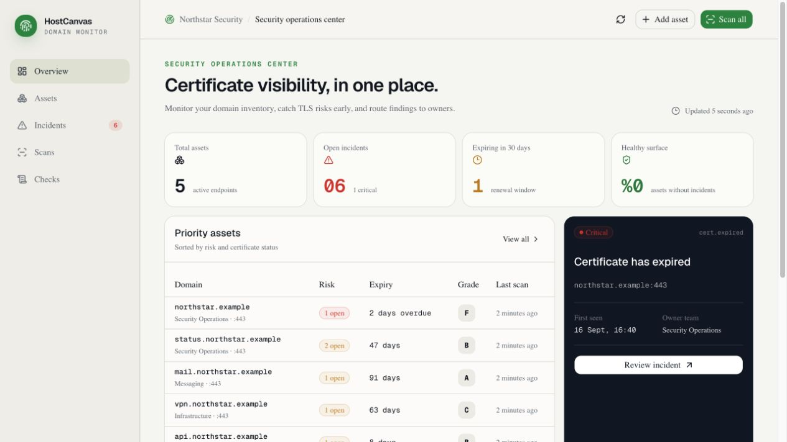
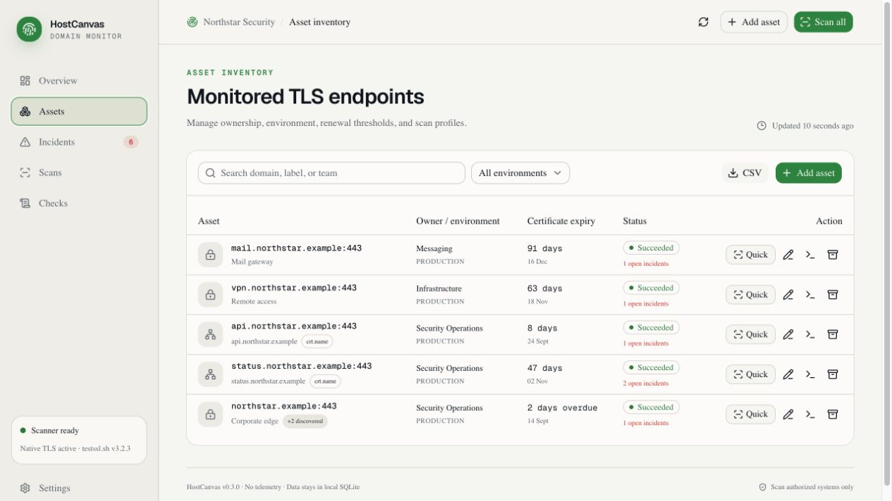
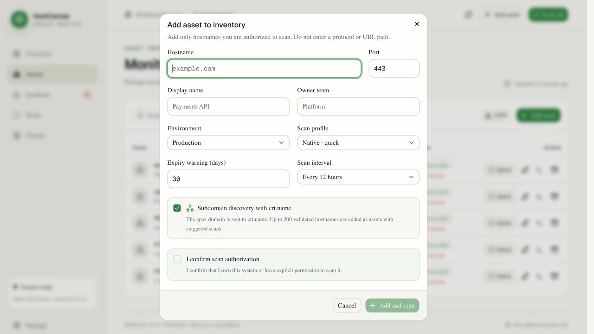
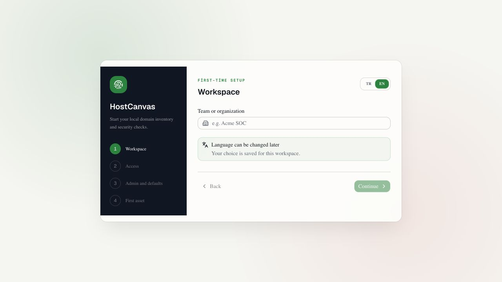

<p align="center">
  
</p>

<p align="center">
  <strong>English</strong> · <a href="README.tr.md">Türkçe</a>
</p>

<p align="center">
  <a href="https://github.com/gorkemguler/HostCanvas/actions/workflows/ci.yml"></a>
  
  
  <a href="LICENSE"></a>
  
</p>

# HostCanvas

> Local-first domain inventory, certificate visibility, security checks, and incident management for teams that operate their own infrastructure.

HostCanvas brings managed domains and hostnames, certificate lifetimes, TLS/DNS/HTTP security checks, and recurring incidents into one local workspace. It is not positioned as a full EASM platform; it focuses on domain inventory and continuous operational security visibility.

The application sends no telemetry. Inventory, administrator accounts, session summaries, and scan history remain in a local SQLite database. The services bind so that LAN use is possible, while application policy keeps LAN access disabled until an administrator explicitly enables it.

## Screenshots

| Operations overview | Asset inventory |
| --- | --- |
|  |  |

| Subdomain discovery | First-time setup |
| --- | --- |
|  |  |

## What is included?

- Domain and port inventory with owner, environment, scan interval, and renewal threshold
- Fast native TLS scanning:
  - certificate validity period and SHA-256 fingerprint
  - hostname/SAN matching
  - chain validation against the system trust store
  - RSA/DSA key length and weak-signature checks
  - TLS 1.0–1.3 support probes
  - negotiated protocol, cipher, ALPN, and ephemeral-key details
  - HSTS, CSP, anti-framing, Referrer-Policy, and nosniff checks
  - Server-header disclosure, obsolete X-XSS-Protection, and cookie SameSite checks
- Optional IDS-friendly `testssl.sh` deep-scan profile
- `pass / fail / unknown` rule model
- Incidents that open, can be assigned or manually resolved, auto-resolve, and reopen
- Scheduled scans, persistent job history, and interrupted-job recovery after restart
- Private-IP disclosure, DNSSEC, DMARC, and SPF checks when a public DNS resolver is configured
- Optional `crt.name` subdomain discovery and source relationships when adding an apex domain
- CSV inventory export
- First-run wizard for language, organization, access policy, administrator, scan defaults, and the first asset
- scrypt password hashing, hashed session tokens, and rate-limited sign-in
- Optional LAN access protected by mandatory authentication and an origin allowlist
- Admin, operator, and viewer roles with last-administrator protection
- Persistent audit events for sign-in, settings, users, assets, scans, incidents, and notifications
- AES-256-GCM encrypted generic and Slack webhooks with severity thresholds and delivery history
- Automatic scan/artifact retention, integrity-checked SQLite backups, and a guarded restore utility
- Single-origin HTTPS LAN deployment through Docker Compose and Caddy
- Responsive Turkish and English operations console

## Quick start

Requirements:

- Node.js `24.9+`
- npm
- Optional: `testssl.sh` 3.2.x for deep scans

```bash
npm install
cp .env.example .env.local
npm run dev
```

Console: [http://localhost:3000](http://localhost:3000)

Local API: [http://localhost:8787/api/health](http://localhost:8787/api/health)

`npm run dev` starts both the web console and the scanning service. The first visit opens the setup wizard, where you select a language and access policy, create the administrator account, and optionally add the first asset. Adding a target requires an explicit confirmation that you are authorized to scan it.

### Docker Compose

For a hardened LAN deployment with testssl.sh 3.2.4 and a Caddy HTTPS reverse proxy:

```bash
docker compose up --build
```

The console is available on the LAN at `https://SERVER-IP:3443`. Enable **LAN access** during setup. A remote first-time setup also requires the one-time code shown by `docker compose logs app`. Caddy creates a local CA on first launch. To remove the browser warning, export the CA certificate and install it as a trusted root only on managed clients:

```bash
docker compose cp proxy:/data/caddy/pki/authorities/local/root.crt ./host-canvas-local-ca.crt
```

The application container runs as a non-root user. Capabilities are dropped, root filesystems are read-only, and persistent state is stored in named volumes. Raw ports `3000` and `8787` bind only to host loopback; the LAN sees only HTTPS port `3443`.

## Security model

```text
User input
    │
    ▼
Validate hostname + port
    │
    ▼
Resolve DNS → classify every IP → pin an allowed IP
    │
    ├── Native TLS / HTTP probe
    └── testssl.sh adapter (no shell, fixed argv, timeout, output limit)
            │
            ▼
     Normalize observations
            │
            ▼
       Pure alert rules
            │
            ▼
      Reconcile incidents
```

Private, loopback, link-local, CGNAT, reserved, and documentation IP ranges are blocked by default. This reduces DNS-rebinding and localhost/metadata SSRF risk. Internal-network scanning requires two independent opt-ins:

1. Set `TLS_SENTINEL_ALLOW_PRIVATE_TARGETS=true` on the server.
2. Enable “Internal network target” for the specific asset.

HostCanvas accepts hostnames only. URLs, paths, wildcards, arbitrary CLI arguments, and direct IP input are rejected. DNS is resolved when a scan runs; the connection is pinned to the validated IP while the original hostname is preserved for SNI.

> Scan only systems you own or have explicit permission to assess.

## Scan profiles

### Native / quick

Designed for frequent execution, with a default interval of 12 hours. It uses Node.js TLS and X.509 APIs and does not send target data to a third-party scanning service.

### testssl.sh / deep

The `testssl.sh` adapter provides cipher/protocol enumeration and known TLS-vulnerability checks. The adapter:

- launches the process with `shell: false`;
- accepts no user-controlled flags or output paths;
- pins the prevalidated IP with `--ip` and uses `--nodns none`;
- enables the `--ids-friendly` profile;
- never enables `--phone-out`;
- limits execution time and stdout/stderr size; and
- creates incidents from normalized JSON findings, not from the process exit code.

A testssl.sh result is not an SSL Labs grade. HostCanvas displays its own lightweight operational score. testssl.sh is licensed under [GPLv2](https://github.com/testssl/testssl.sh/blob/3.2/LICENSE); the Docker image carries the pinned source and its license under `/opt/testssl`.

## Subdomain discovery

The `Subdomain discovery with crt.name` option sends the apex domain to the `https://crt.name/v1/search` API. HostCanvas validates the response with its IDNA/hostname rules, rejects wildcards and out-of-scope domains, removes duplicates, and adds up to 200 subdomains as new assets by default. Discovered assets are linked to their parent, tagged with the `crt.name` source, and scheduled gradually to avoid an immediate scan storm.

This passive discovery covers only names visible in public certificate transparency data and the `crt.name` index. It does not prove that a hostname is still live or owned by the organization. The free service is limited to 100 requests per IP per day. Because the apex domain is sent to an external service, the option is clearly presented and can be disabled.

## Alert catalog

| Rule | Default severity | Source |
| --- | --- | --- |
| Certificate expired | Critical | Native TLS |
| Certificate entered renewal window | Low–high by days remaining | Native TLS |
| Hostname/SAN mismatch | High | Native TLS |
| Untrusted certificate chain | High | Native TLS |
| Certificate not yet valid | High | Native TLS |
| Weak public key or signature | High | Native TLS |
| TLS 1.0 or 1.1 enabled | High | Native TLS |
| TLS 1.2 unavailable | High | Native TLS |
| HSTS missing | Medium | Native HTTP |
| Baseline HTTP security headers missing | Medium | Native HTTP |
| Server header technology disclosure | Low | Native HTTP |
| Obsolete X-XSS-Protection enabled | Low | Native HTTP |
| Cookie SameSite missing | Low | Native HTTP |
| Private IP exposed in public DNS | High | Configured public resolver |
| DNSSEC missing | Medium | Configured public resolver |
| DMARC missing or weak | Medium–high | Configured public resolver |
| SPF missing or invalid | Medium–high | Configured public resolver |
| testssl.sh JSON findings | Dynamic | testssl.sh |

If a probe times out or its parser fails, the rule returns `unknown`. An `unknown` result never closes an existing incident; only a reliable `pass` for the same rule can auto-resolve it.

## Configuration

All options and secure defaults are documented in [.env.example](.env.example).

| Variable | Default | Description |
| --- | --- | --- |
| `TLS_SENTINEL_API_HOST` | `0.0.0.0` | API bind address; application policy still controls actual access |
| `TLS_SENTINEL_WEB_HOST` | `0.0.0.0` | Web-console bind address |
| `TLS_SENTINEL_UI_ORIGINS` | localhost origins | Additional console origins that are always trusted |
| `TLS_SENTINEL_ALLOW_PRIVATE_TARGETS` | `false` | Globally allows internal-network targets |
| `TLS_SENTINEL_PUBLIC_DNS_RESOLVER` | disabled | Enables public DNS, DNSSEC, DMARC, and SPF rules |
| `TLS_SENTINEL_CRT_NAME_ENABLED` | `true` | Allows optional crt.name discovery when adding an asset |
| `TLS_SENTINEL_CRT_NAME_LIMIT` | `200` | Maximum assets created in one discovery (`1–500`) |
| `TLS_SENTINEL_TESTSSL_PATH` | `testssl.sh` | Scanner executable path |
| `TLS_SENTINEL_MAX_CONCURRENT_SCANS` | `2` | Global concurrent-scan limit |
| `TLS_SENTINEL_DATA_DIR` | `./data` | SQLite and raw testssl artifact directory |
| `TLS_SENTINEL_SECRET_KEY` | automatic `/data/.secret-key` | Webhook-secret encryption key; may come from an external secret manager |
| `TLS_SENTINEL_TRUST_PROXY` | `false` | Trusts the real client IP only behind an explicitly trusted reverse proxy |

For LAN access, open **Settings → LAN access** from localhost and add the actual console origin you will use, such as `http://192.168.1.20:3000`. Authentication cannot be disabled while LAN access is enabled. A remote first-time setup also requires the one-time code printed by the server.

The rebrand to HostCanvas deliberately keeps the `TLS_SENTINEL_*` environment variables, `tlsentinel.db` filename, and legacy backup format to avoid breaking existing installations and automation.

Do not expose HostCanvas directly to the public internet. If remote access is required, place it behind a VPN or Zero Trust access layer, use an organizational certificate, and restrict the origin allowlist to the real console address. Do not set `NEXT_PUBLIC_TLS_SENTINEL_API_URL` for normal LAN deployments; under HTTPS, the console uses the same origin for the API.

## Roles and notifications

| Role | Access |
| --- | --- |
| `admin` | Full access, including workspace, teams, webhooks, audit, retention, and backups |
| `operator` | Add, edit, archive, and scan assets; manage incident status |
| `viewer` | Read-only access to dashboards, assets, scans, checks, and incidents |

Manage users and webhook channels under **Settings → Administration center**. The API never returns the full webhook URL. Only `https://` URLs on port `443` are accepted; destination DNS is validated against the public-IP policy and connections are pinned to the validated IP.

## Backup and maintenance

The hourly maintenance job creates a verified SQLite backup every 24 hours by default, retains 14 backups, removes completed scan history older than 180 days, and removes testssl artifacts older than 30 days. Configure these values under **Settings → Administration center → Data**.

```bash
npm run backup
# Stop the application before restoring:
npm run restore -- /absolute/path/tlsentinel-YYYYMMDDTHHMMSSZ.db --confirm
```

The restore utility runs `PRAGMA quick_check`, verifies required tables, stops when the current database is locked, and creates a `data/backups/pre-restore-*` recovery copy before replacement. See [docs/operations.md](docs/operations.md) for the complete runbook.

## Commands

```bash
npm run dev       # web + API in watch mode
npm test          # security, rule, and incident tests
npm run lint      # lint application code
npx tsc --noEmit  # TypeScript check
npm run build     # production web build
npm start         # web + API after a build
npm run backup    # integrity-checked manual SQLite backup
npm run restore -- /backup.db --confirm  # guarded restore while the app is stopped
```

## Project structure

```text
app/                    React operations console
server/
  api.mjs               Setup, session, LAN policy, and scan REST API
  auth.mjs              Password and hashed-session management
  db.mjs                SQLite schema and incident reconciliation
  scanner.mjs           Queue, scheduler, and probe orchestration
  probes/                Native TLS, HTTP, DNS, and testssl adapters
  rules/                 Alert evaluation without network access
  security/              Hostname/IP normalization and target policy
  notifications.mjs      Encrypted, SSRF-protected webhook delivery
  maintenance.mjs        Retention and SQLite backups
tests/                   Rule, incident, parser, and SSRF-defense tests
data/                    Local data excluded from Git
```

See [docs/adding-a-check.md](docs/adding-a-check.md) to add a new alert.

## Known limitations and next rule packs

- Native legacy-protocol results are limited by the local Node/OpenSSL build; use testssl.sh for deeper validation.
- The public-DNS private-IP check avoids split-horizon false positives by not using the system resolver and is disabled by default.
- `crt.name` discovery is passive and depends on an external index; it is neither liveness nor ownership verification. Large result sets are capped safely.
- Email notifications, SSO/OIDC, snooze policies, and maintenance windows are not included in this release.
- Backups are produced in the same data volume and are therefore not disaster recovery; regularly copy selected backups to separate encrypted storage.
- Candidate rule packs include dangling CNAME, unexpected NS/MX changes, controlled CORS/path-exposure checks, STARTTLS, OCSP stapling, certificate-transparency changes, and service-banner policies.

SSL Labs is not the primary engine because its API scans public systems from Qualys infrastructure and has usage and quota constraints. It may be added later as an explicitly enabled comparison adapter for public assets. See the [SSL Labs API v4 documentation](https://github.com/ssllabs/ssllabs-scan/blob/master/ssllabs-api-docs-v4.md) and the [official testssl.sh project](https://github.com/testssl/testssl.sh).
