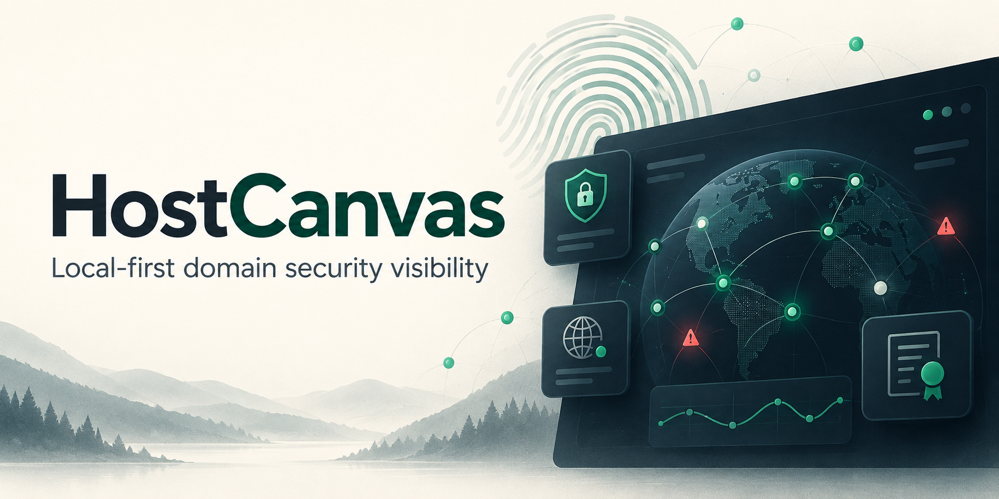
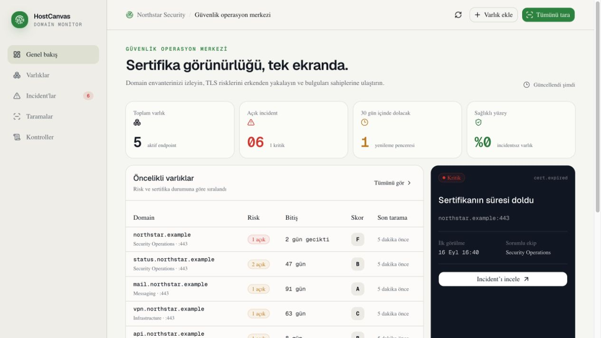
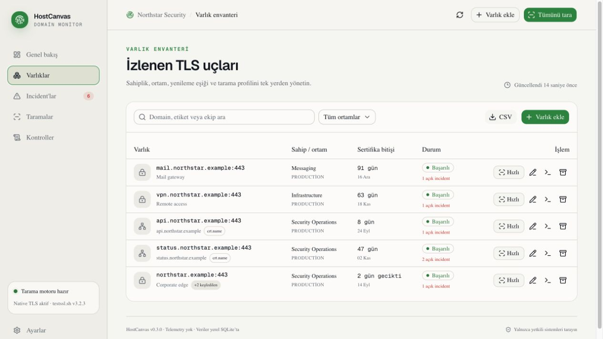
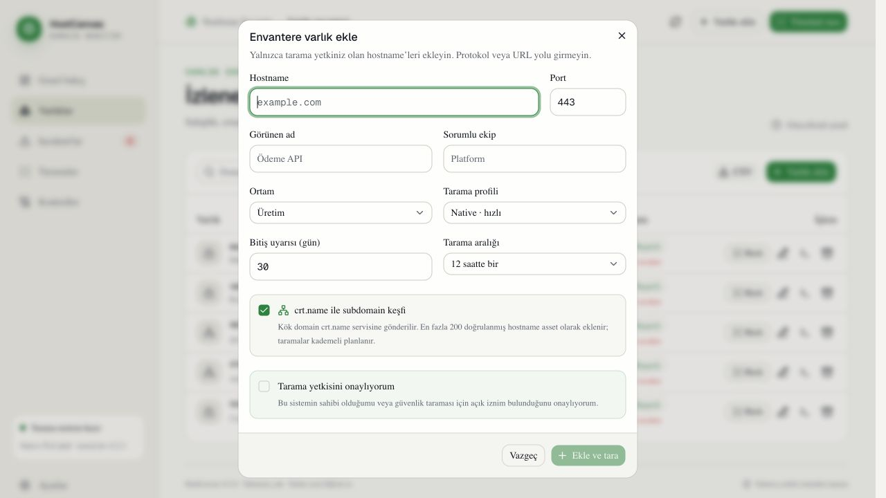
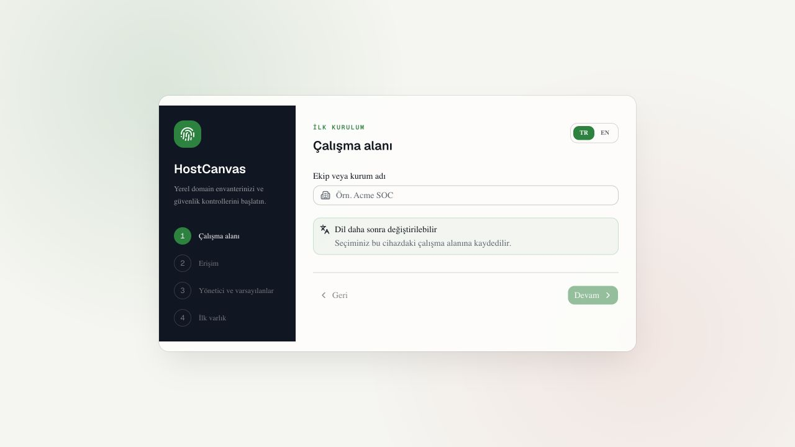

<p align="center">
  
</p>

<p align="center">
  <a href="README.md">English</a> · <strong>Türkçe</strong>
</p>

<p align="center">
  <a href="https://github.com/gorkemguler/HostCanvas/actions/workflows/ci.yml"></a>
  
  
  <a href="LICENSE"></a>
  
</p>

# HostCanvas

> Kendi altyapısını işleten ekipler için local-first domain envanteri, sertifika görünürlüğü, güvenlik kontrolleri ve incident yönetimi.

HostCanvas, ekiplerin yönettikleri domain ve hostname envanterini; sertifika süreleri, TLS/DNS/HTTP güvenlik kontrolleri ve tekrar eden incident’larla birlikte tek bir yerel çalışma alanında izlemesini sağlayan local-first bir güvenlik uygulamasıdır. Tam kapsamlı bir EASM platformu olmayı iddia etmez; domain envanteri ve düzenli güvenlik görünürlüğüne odaklanır.

Uygulama telemetry göndermez; envanteri, yönetici hesabını, oturum özetlerini ve tarama geçmişini yerel SQLite veritabanında tutar. Sunucular LAN bağlantısını kabul edecek şekilde dinler ancak uygulama politikası ilk kurulumda LAN erişimini kapalı tutar.

## Belgeler

Kurulum, LAN güvenliği, tarama akışı, bildirim ve kurtarma için [Türkçe/İngilizce Wiki](https://github.com/gorkemguler/HostCanvas/wiki) veya [depodaki sürümlenen kopyasını](docs/wiki-index.md) okuyun.

Kendi incident türünüzü eklemek için [ayrıntılı özel kural rehberini](docs/wiki/Ozel-Incident-Turu-Olusturma.md) ve test edilen örneği izleyin. Kurallar bugün kodla eklenir; görsel template editörü henüz yoktur.

## Ekran görüntüleri

| Genel bakış | Varlık envanteri |
| --- | --- |
|  |  |

| Subdomain keşfi | İlk kurulum |
| --- | --- |
|  |  |

## Neler hazır?

- Domain + port envanteri, sahip ekip, ortam, tarama aralığı ve yenileme eşiği
- Hızlı native TLS taraması:
  - sertifika başlangıç/bitiş zamanı ve SHA-256 fingerprint
  - hostname/SAN eşleşmesi
  - sistem trust store ile zincir doğrulaması
  - RSA/DSA anahtar uzunluğu ve zayıf imza kontrolü
  - TLS 1.0–1.3 destek probe’ları
  - negotiated protokol, cipher, ALPN ve ephemeral key bilgisi
  - HSTS, CSP, anti-framing, Referrer-Policy ve nosniff kontrolleri
  - Server başlığı ifşası, eski X-XSS-Protection ve cookie SameSite kontrolleri
- Opsiyonel, IDS-friendly `testssl.sh` derin tarama profili
- `pass / fail / unknown` kural modeli
- Açılma, sahiplenme, manuel çözme, otomatik çözme ve yeniden açılma davranışına sahip incident’lar
- Zamanlanmış taramalar, kalıcı iş geçmişi ve restart sonrası yarım kalan işi geri alma
- Public DNS resolver yapılandırıldığında private IP ifşası, CAA, DMARC ve SPF kontrolleri
- Açık onayla etkinleştirilen, kimliği doğrulanmış DNS-over-TLS resolver üzerinden DNSSEC durumu
- Ayarlanabilir HSTS/cookie/CAA politikaları ve kalıcı ardışık tarama hatası incident’ları
- Yeni bir kök domain eklenirken isteğe bağlı `crt.name` subdomain keşfi ve kaynak ilişkisi
- CSV envanter çıktısı
- İlk çalıştırma sihirbazı: dil, kurum, erişim politikası, yönetici hesabı, tarama varsayılanları ve ilk varlık
- scrypt parola özeti, hashlenmiş oturum belirteçleri ve hız sınırlamalı giriş
- Kimlik doğrulaması zorunlu, origin allowlist ile sınırlandırılmış isteğe bağlı LAN erişimi
- Admin / operator / viewer rolleri, kullanıcı yönetimi ve son yöneticiyi koruyan RBAC
- Giriş, ayar, kullanıcı, asset, tarama, incident ve bildirim işlemleri için kalıcı audit kaydı
- AES-256-GCM ile şifreli generic/Slack webhook adresleri, önem eşiği ve teslimat geçmişi
- Otomatik scan/artifact retention, bütünlük kontrollü SQLite yedekleri ve güvenli geri yükleme aracı
- Docker Compose ile Caddy üzerinden tek-origin HTTPS LAN dağıtımı
- Türkçe/İngilizce, responsive operasyon paneli

## Hızlı başlangıç

Gereksinimler:

- Node.js `24.21+` (CI/Docker sürümü `.node-version` dosyasında sabittir)
- npm
- Derin tarama için opsiyonel `testssl.sh` 3.2.x

```bash
npm ci
cp .env.example .env.local
npm run dev
```

Panel: [http://localhost:3000](http://localhost:3000)

Canlılık kontrolü: [http://localhost:8787/api/health/live](http://localhost:8787/api/health/live). Ayrıntılı `/api/health` için çalışma alanına erişim gerekir.

`npm run dev`, web panelini ve tarama motorunu birlikte başlatır. İlk açılışta dil ve erişim ayarlarını seçer, sunucu konsolundaki kurulum kodunu girer, yönetici hesabını oluşturur ve isterseniz ilk varlığı eklersiniz. Kod localhost için de zorunludur ve 15 dakika geçerlidir; süresi dolduğunda sihirbazı yenileyip konsoldaki yeni kodu kullanın. Hedef eklerken tarama yetkiniz olduğunu onaylamanız gerekir.

### Docker Compose

Docker yüklüyse testssl.sh 3.2.4 ve Caddy HTTPS reverse proxy ile sertleştirilmiş LAN kurulumu:

```bash
cp .env.example .env
# .env içinde TLS_SENTINEL_HTTPS_HOST değerini sunucunun hostname veya IPv4 adresi yapın.
docker compose up --build
```

Paneli yapılandırdığınız adresle `https://<TLS_SENTINEL_HTTPS_HOST>:3443` üzerinden açın. Varsayılan `localhost` değeridir; uzak kurulum öncesinde protokol, port ve yol içermeyen bir LAN hostname/IPv4 adresi yazın. İlk kurulumda **LAN erişimi** seçeneğini açın ve `docker compose logs app` çıktısındaki kodu girin. Caddy ilk çalıştırmada yerel bir CA üretir. CA sertifikasını dışarı alın ve yalnızca yönettiğiniz istemcilere güvenilir kök olarak kurun:

```bash
docker compose cp proxy:/data/caddy/pki/authorities/local/root.crt ./host-canvas-local-ca.crt
```

Uygulama container’ı non-root çalışır; iki serviste de capabilities düşürülür, root filesystem read-only’dir ve kalıcı veriler named volume’larda tutulur. Ham `3000` ve `8787` portları yalnızca host loopback’e bağlıdır; LAN’a yalnızca HTTPS `3443` açılır.

## Güvenlik modeli

```text
Kullanıcı girdisi
      │
      ▼
Hostname + port doğrulama
      │
      ▼
DNS resolve → tüm IP’leri sınıflandır → izinli IP’yi sabitle
      │
      ├── Native TLS / HTTP probe
      └── testssl.sh adapter (sabit argv, süre ve kaynak limitleri)
              │
              ▼
       Normalize gözlemler
              │
              ▼
       Saf alarm kuralları
              │
              ▼
       Incident uzlaştırma
```

Varsayılan olarak private, loopback, link-local, CGNAT, reserved ve documentation IP aralıkları taranamaz. Bu davranış DNS rebinding ve localhost/metadata SSRF riskini azaltır. İç ağ taraması için iki ayrı onay gerekir:

1. Sunucuda `TLS_SENTINEL_ALLOW_PRIVATE_TARGETS=true`
2. İlgili varlıkta “İç ağ hedefi” seçeneği

Uygulama yalnızca hostname kabul eder; URL, path, wildcard, serbest CLI argümanı ve doğrudan IP girişi reddedilir. DNS çalışma anında çözülür ve bağlantı doğrulanan IP’ye yapılırken orijinal hostname SNI olarak korunur.

> Bu araç yalnızca sahibi olduğunuz veya açık tarama izni aldığınız sistemlerde kullanılmalıdır.

## Tarama profilleri

### Native / hızlı

Sık çalıştırılmak üzere tasarlanmıştır. Varsayılan aralık 12 saattir. Node.js TLS ve X.509 API’lerini kullanır; üçüncü taraf servise veri göndermez.

### testssl.sh / derin

Cipher/protokol enumerasyonu ve bilinen TLS zafiyet kontrolleri için `testssl.sh` adapter’ını kullanır. Adapter:

- sabit argümanları `shell: false` ile geçirir; POSIX üzerinde sabit bir shell sarmalayıcısı dosya limitini ayarlayıp `exec` çalıştırır, hedef girdisi shell metnine eklenmez,
- kullanıcıdan flag veya output path kabul etmez,
- önceden doğrulanmış IP’yi `--ip` ile sabitler ve `--nodns none` kullanır,
- `--ids-friendly` profilini etkinleştirir,
- `--phone-out` kullanmaz,
- süre, stdout/stderr, JSON artifact ve POSIX dosya boyutu limitlerini uygular; alt sürece uygulama secret’larını aktarmayan sınırlı bir ortam verir,
- incident’ı exit code’dan değil JSON bulgularından üretir.

`testssl.sh` sonucu SSL Labs derecesi değildir. HostCanvas kendi basit operasyonel skorunu gösterir. Testssl.sh [GPLv2](https://github.com/testssl/testssl.sh/blob/3.2/LICENSE) lisanslıdır; Docker imajı sabitlenmiş kaynak sürümünü `/opt/testssl` altında lisansıyla birlikte taşır.

## Subdomain keşfi

Asset ekleme ekranındaki `crt.name ile subdomain keşfi` seçeneği kök domaini `https://crt.name/v1/search` API’sine gönderir. HostCanvas dönen kayıtları IDNA/hostname kurallarıyla doğrular, wildcard ve farklı domain sonuçlarını reddeder, tekrarları ayıklar ve varsayılan olarak en fazla 200 subdomaini yeni asset olarak kaydeder. Keşfedilen asset’lar kök asset ile ilişkilendirilir, `crt.name` kaynağıyla etiketlenir ve anlık bir tarama fırtınası oluşturmamak için ilk kontrolleri kademeli planlanır.

Bu pasif keşif yalnızca public sertifika şeffaflığı ve `crt.name` indeksinde görülen isimleri kapsar; bir hostname’in halen canlı veya kuruma ait olduğunu tek başına kanıtlamaz. Sağlayıcının kotaları geçerlidir. Kök domain dış servise gönderildiği için keşif varsayılan olarak seçili değildir; her varlık için açıkça etkinleştirilir.

## Alarm kataloğu

| Kural                                | Varsayılan önem              | Kaynak                          |
| ------------------------------------ | ---------------------------- | ------------------------------- |
| Sertifika süresi dolmuş              | Kritik                       | Native TLS                      |
| Yenileme penceresine girmiş          | Kalan güne göre düşük–yüksek | Native TLS                      |
| Hostname/SAN eşleşmiyor              | Yüksek                       | Native TLS                      |
| Zincir güvenilir değil               | Yüksek                       | Native TLS                      |
| Sertifika henüz geçerli değil        | Yüksek                       | Native TLS                      |
| Zayıf açık anahtar / imza            | Yüksek                       | Native TLS                      |
| TLS 1.0 veya 1.1 etkin               | Yüksek                       | Native TLS                      |
| TLS 1.2 bulunamadı                   | Yüksek                       | Native TLS                      |
| HSTS eksik                           | Orta                         | Native HTTP                     |
| Etkisiz HSTS politikası | Orta | Native HTTP + çalışma alanı politikası |
| Temel HTTP güvenlik başlıkları eksik | Orta                         | Native HTTP                     |
| Server başlığı teknoloji ifşası      | Düşük                        | Native HTTP                     |
| Eski X-XSS-Protection etkin          | Düşük                        | Native HTTP                     |
| Cookie SameSite eksik                | Düşük                        | Native HTTP                     |
| Cookie Secure eksik | Düşük | Native HTTP |
| Tanımlı oturum cookie’sinde HttpOnly eksik | Orta | Native HTTP + açıkça belirtilen cookie adları |
| Public DNS’te private IP             | Yüksek                       | Yapılandırılmış public resolver |
| CAA politika uyumsuzluğu | Düşük | Public resolver + çalışma alanı politikası |
| DNSSEC eksik | Orta | İsteğe bağlı doğrulayıcı DNS-over-TLS resolver |
| DNSSEC doğrulama hatası | Yüksek | Resolver’ın TLS üzerinden bildirdiği DNSSEC hatası |
| Ardışık eksik taramalar | Orta | Kalıcı tarama geçmişi |
| DMARC eksik / zayıf politika         | Orta–yüksek                  | Yapılandırılmış public resolver |
| SPF eksik / hatalı                   | Orta–yüksek                  | Yapılandırılmış public resolver |
| testssl.sh JSON bulguları            | Dinamik                      | testssl.sh                      |

Bir probe timeout veya parser hatası verirse kural sonucu `unknown` olur. `unknown`, mevcut incident’ı kapatmaz. Incident yalnızca aynı kuralın güvenilir bir taramada `pass` dönmesiyle otomatik çözülür.

### Kontrol politikası

Yöneticiler **Ayarlar → Incident kontrol politikası** bölümünden eşikleri değiştirebilir. Varsayılanlar: HSTS için en az 180 gün, isteğe bağlı `includeSubDomains`, açık Secure kontrolü, boş oturum cookie listesi, isteğe bağlı CAA ve üç ardışık `failed`/`partial` taramadan sonra tarama sağlığı incident’ı. HttpOnly kontrolü yalnızca açıkça listelenen oturum cookie adlarına uygulanır; cookie değerleri saklanmaz. Başarılı tarama hata sayacını sıfırlar ve tarama sağlığı incident’ını çözer; ilgisiz güvenlik bulgularını kapatmaz.

Politika yerelde saklanır ve sonraki tarama başladığında uygulanır. Kontrolü kapatmak eski incident’larını çözmez. DNSSEC artık ayrı `TLS_SENTINEL_DNSSEC_RESOLVER` onayı gerektirir; yalnızca public DNS ayarı yeterli değildir. Davranış, gizlilik, API örnekleri ve sınırlamalar için [ayrıntılı politika rehberini](docs/wiki/Kontrol-Politikalari.md) okuyun.

## Yapılandırma

Tüm seçenekler ve güvenli varsayılanlar [.env.example](.env.example) içinde belgelenmiştir.

Önemli seçenekler:

| Değişken                             | Varsayılan                   | Açıklama                                                                   |
| ------------------------------------ | ---------------------------- | -------------------------------------------------------------------------- |
| `TLS_SENTINEL_API_HOST`              | `0.0.0.0`                    | API bind adresi; gerçek erişim uygulama politikasıyla sınırlandırılır      |
| `TLS_SENTINEL_WEB_HOST`              | `0.0.0.0`                    | Web paneli bind adresi                                                     |
| `TLS_SENTINEL_UI_ORIGINS`            | localhost origin’leri        | Daima güvenilen ek panel origin’leri                                       |
| `TLS_SENTINEL_ALLOW_PRIVATE_TARGETS` | `false`                      | İç ağ hedeflerini global olarak açar                                       |
| `TLS_SENTINEL_PUBLIC_DNS_RESOLVER` | kapalı | Public DNS ifşası, CAA, DMARC ve SPF kurallarını etkinleştirir |
| `TLS_SENTINEL_DNSSEC_RESOLVER` | kapalı | Güvenilen doğrulayıcı DNS-over-TLS hostname’i; TCP 853; sorgulanan adlar sağlayıcıya gönderilir |
| `TLS_SENTINEL_CRT_NAME_ENABLED`      | `true`                       | Asset eklerken isteğe bağlı crt.name subdomain keşfine izin verir          |
| `TLS_SENTINEL_CRT_NAME_LIMIT`        | `200`                        | Bir keşifte eklenecek yeni asset üst sınırı (`1–500`)                      |
| `TLS_SENTINEL_TESTSSL_PATH`          | `testssl.sh`                 | Scanner executable yolu                                                    |
| `TLS_SENTINEL_MAX_CONCURRENT_SCANS`  | `2`                          | Global eşzamanlı tarama limiti                                             |
| `TLS_SENTINEL_DATA_DIR`              | `./data`                     | SQLite ve ham testssl artifact dizini                                      |
| `TLS_SENTINEL_SECRET_KEY`            | otomatik `/data/.secret-key` | Webhook secret şifreleme anahtarı; harici secret manager ile verilebilir   |
| `TLS_SENTINEL_TRUST_PROXY`           | `false`                      | Yalnızca güvenilen reverse proxy arkasında gerçek istemci IP’sini kullanır |

Yerel başlatıcılar ve API, `.env.local`/`.env` ile moda özel dosyalardaki `TLS_SENTINEL_*` ayarlarını okur; doğrudan ortam değişkenleri önceliklidir. Docker Compose varsayılan olarak `.env` okur; diğer dosya için `docker compose --env-file .env.local ...` kullanın. API secret’ları web ve tarayıcı motoru alt süreçlerinden ayıklanır.

LAN erişimi için gerçek HTTPS adresini (ör. `https://192.168.1.20:3443`) **Ayarlar → LAN erişimi** bölümüne ekleyin. Uzaktan erişimde HTTPS ve kimlik doğrulama zorunludur. Özel reverse proxy kullanıyorsanız ilk kurulumdan önce hostname’in Host doğrulamasından geçmesi için `TLS_SENTINEL_UI_ORIGINS` tanımlayın. `TLS_SENTINEL_TRUST_PROXY` yalnızca doğrudan API erişimi güvenilir istemci/proxy’lerle sınırlandırılmışsa açılmalıdır; proxy `X-Forwarded-For` ve `X-Forwarded-Proto` başlıklarını kendisi yazmalıdır.

HostCanvas adıyla yeniden markalanan bu sürüm, mevcut kurulumların veri dizinlerini ve otomasyonlarını bozmamak için `TLS_SENTINEL_*` ortam değişkenlerini, `tlsentinel.db` veritabanı adını ve eski yedek dosyası biçimini geriye dönük uyumluluk amacıyla korur.

Uygulamayı doğrudan internete yayınlamayın. İnternet erişimi gerekiyorsa VPN/Zero Trust erişim katmanı arkasına alın, kurumsal sertifika kullanın ve izinli origin listesini gerçek panel adresleriyle sınırlandırın. `NEXT_PUBLIC_TLS_SENTINEL_API_URL` değerini normal LAN kurulumlarında tanımlamayın; HTTPS kullanıldığında panel API’yi aynı origin üzerinden çağırır.

## Roller ve bildirimler

| Rol        | Yetki                                                                         |
| ---------- | ----------------------------------------------------------------------------- |
| `admin`    | Çalışma alanı, ekip, webhook, audit, retention ve yedekler dahil tüm işlemler |
| `operator` | Asset ekleme/düzenleme/arşivleme, tarama ve incident durum yönetimi           |
| `viewer`   | Dashboard, asset, scan, check ve incident verilerine salt okunur erişim       |

Yeni kullanıcıları ve webhook kanallarını **Ayarlar → Yönetim merkezi** bölümünden yönetin. Webhook URL’sinin tamamı API’ye geri verilmez. Yalnızca `https://` ve port `443` kabul edilir; hedef DNS cevabı bağlantıdan önce public IP politikasıyla doğrulanır ve bağlantı doğrulanan IP’ye sabitlenir.

## Yedekleme ve bakım

Bakım işi saatlik kontrol edilir; varsayılan olarak 24 saatte bir doğrulanmış SQLite yedeği oluşturur, 14 yedek saklar, 180 günden eski tamamlanmış scan geçmişini ve 30 günden eski testssl artifact’larını temizler. Tüm değerler **Ayarlar → Yönetim merkezi → Veri** altında değiştirilebilir.

```bash
npm run backup
# Uygulamayı durdurduktan sonra:
npm run restore -- /tam/yol/tlsentinel-YYYYMMDDTHHMMSSZ.db --confirm
```

Geri yükleme aracı kaynak yedeğe `PRAGMA quick_check` uygular, gerekli tabloları doğrular, mevcut veritabanı kilitliyse durur ve değiştirmeden önce `data/backups/pre-restore-*` kurtarma kopyası oluşturur. Ayrıntılı runbook için [docs/operations.md](docs/operations.md) belgesine bakın.

## Komutlar

```bash
npm run dev       # web + API, watch mode
npm test          # güvenlik, kural ve incident testleri
npm run lint      # ürün kodu lint kontrolü
npx tsc --noEmit  # TypeScript kontrolü
npm run build     # production web build
npm start         # build sonrasında web + API
npm run backup    # bütünlük kontrollü manuel SQLite yedeği
npm run restore -- /yedek.db --confirm  # uygulama kapalıyken geri yükleme
```

## Proje yapısı

```text
app/                    React operasyon paneli
server/
  api.mjs               Kurulum, oturum, LAN politikası ve tarama REST API’si
  auth.mjs              Parola ve hashlenmiş oturum yönetimi
  db.mjs                SQLite şeması ve incident uzlaştırma
  scanner.mjs           Kuyruk, scheduler ve probe orkestrasyonu
  probes/                Native TLS, HTTP, DNS, testssl adapter’ları
  rules/                 Ağ erişimi yapmayan alarm değerlendirmeleri
  security/              Hostname/IP normalizasyonu ve hedef politikası
  notifications.mjs      Şifreli, SSRF-korumalı webhook teslimatı
  maintenance.mjs        Retention ve SQLite yedekleme
tests/                   Rule, incident, parser ve SSRF savunma testleri
data/                    Git dışı yerel veriler
```

Yeni alarm eklemek için [docs/adding-a-check.md](docs/adding-a-check.md) belgesine bakın.

## Bilinen sınırlar ve sonraki rule-pack’ler

- Webhook teslimatı deneme başına DNS dahil 8 saniye ve geçici hatalarda en fazla 3 denemeyle sınırlıdır; taramalar teslimatı beklemez. Teslimat geçmişi kalıcıdır, bekleyen işler bellektedir: yeniden başlatmada otomatik tekrar gönderim yoktur. Timeout sonrası yinelenen olayları alıcı tarafında ayıklayın.
- POSIX üzerinde mevcut ve yeni veri dizinleri `0700`, veritabanı/yedek/secret dosyaları `0600` yapılır. Veri dizini kilidi, uygulama/yedekleme açıkken geri yüklemeyi ve aynı dizinde ikinci API sürecini engeller.
- Native legacy-protokol sonucu, yerel Node/OpenSSL build’inin destekleyebildiği handshake’lerle sınırlıdır; derin doğrulama için testssl.sh kullanılmalıdır.
- Public DNS private-IP kontrolü split-horizon yanlış pozitiflerini önlemek için sistem resolver’ını kullanmaz ve varsayılan olarak kapalıdır.
- `crt.name` keşfi pasiftir ve dış indeks sonuçlarına bağlıdır; canlılık veya sahiplik doğrulaması değildir. Büyük sonuç kümeleri güvenli üst sınırla kesilir.
- E-posta bildirimi, SSO/OIDC, snooze politikası ve bakım pencereleri bu sürümde yoktur.
- Yedekler aynı data volume’unda üretildiği için afet kurtarma sayılmaz; seçili yedekleri düzenli olarak başka bir şifreli ortama kopyalayın.
- Sonraki rule-pack adayları: dangling CNAME, beklenmeyen NS/MX değişimi, kontrollü CORS/path exposure kontrolleri, STARTTLS, OCSP stapling, certificate-transparency değişiklikleri ve servis banner politikaları.

SSL Labs API, yalnızca public sistemleri Qualys altyapısından taradığı ve kullanım/kota koşulları bulunduğu için temel motor yapılmadı. İleride açıkça etkinleştirilen, public varlıklara özel bir karşılaştırma adapter’ı olarak eklenebilir. Ayrıntılar için [SSL Labs API v4 dokümantasyonu](https://github.com/ssllabs/ssllabs-scan/blob/master/ssllabs-api-docs-v4.md) ve [testssl.sh resmi projesi](https://github.com/testssl/testssl.sh) referans alınmıştır.
